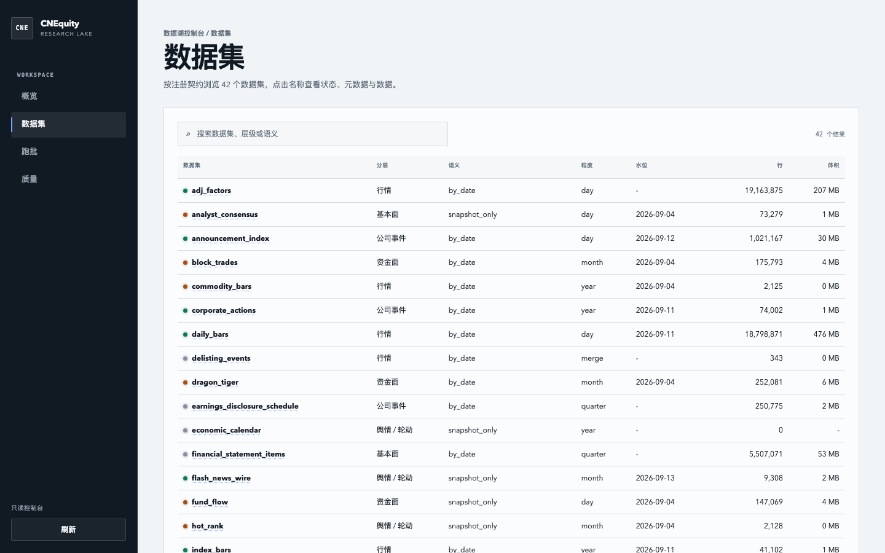

<h1 align="center">CNEquity · Open financial data infrastructure</h1>
<p align="center">A local, refreshable Parquet lake for China A-share market, fundamental, event, and macro data — built to be queried again, not fetched once.</p>

<p align="center">
  <a href="https://github.com/rootSunc/CNEquity/actions/workflows/ci.yml"></a>
  <a href="https://pypi.org/project/cnequity/"></a>
  <a href="https://www.python.org/downloads/"></a>
  <a href="LICENSE"></a>
  <a href="https://rootsunc.github.io/CNEquity/"></a>
  <a href="README.md"></a>
</p>


<p align="center">
  <b>42 datasets · Python / DuckDB / Polars / MCP</b>
</p>

<p align="center">
  
</p>

<p align="center"><sub><code>cne serve</code>, read-only console — a real capture: tier, fetch semantics, partition granularity, watermark, row count and size per dataset</sub></p>


<p align="center">
  <a href="https://rootsunc.github.io/CNEquity/getting-started/quickstart/">Quickstart</a> ·
  <a href="https://rootsunc.github.io/CNEquity/datasets/catalog/">Dataset catalog</a> ·
  <a href="https://rootsunc.github.io/CNEquity/recipes/">Research recipes</a> ·
  <a href="https://rootsunc.github.io/CNEquity/reference/mcp/">AI agents</a>
</p>

CNEquity is open, signup-free, and self-hosted. It does not emit trading signals. It keeps fragmented sources — different fields, calendars, and refresh cadences — on your own machine or server, and records where each row came from, when it was fetched, and through which date it is usable.

## Why a lake

Issuing one API request is rarely the hard part. Keeping a research contract stable over years is:

- **Multi-source consistency:** fields, symbol systems, refresh cadence and backfill windows do not match;
- **Reproducible history:** fetching at research time lets results drift with the vendor;
- **Universe completeness:** using today's roster to look at the past silently drops names that later delisted;
- **PIT semantics:** filings, announcements and valuations must be queried as of the date they were actually available;
- **Adjustment and trading status:** if every script handles these itself, the contract forks.

Survivorship bias is the intuitive example. The same equal-weight buy-and-hold, the same dates; the only difference is whether names that later delisted stay in the basket. Use stocks that still trade today, and the 2016–2021 return goes from **5.9% to 12.0%**:

<p align="center">
  
</p>

Those names are not zero — they are absent. CNEquity therefore treats delisted names, adjustment factors, historical membership and PIT as lake concerns, not something each downstream script stitches together.

```bash
python scripts/survivorship_gap.py --svg docs/assets/survivorship-gap.svg
```

## Data coverage

The current spine is China A-share research, not every financial dataset. Registered datasets cover:

- instruments, trading calendar and trading status;
- stock, index, industry and sector daily bars, minute bars, ticks and adjustment factors;
- corporate actions, announcement index and earnings disclosure schedules;
- financials, valuations, share structure, holders and analyst consensus;
- northbound flow, margin trading, dragon-tiger lists, block trades and fund flow;
- index constituents, industry classification, macro indicators and market breadth;
- news, wires, sentiment, rotation, share unlocks and regulatory events.

The registry currently holds **42 datasets: 39 curated + 3 derived**, grouped L0–L8 by research use.

| Tier | Research use | Representative datasets |
|---|---|---|
| L0 | Reference | instruments, calendar, trading status |
| L1 | Market data | daily / index bars, adjustment, minutes, ticks, delisting events |
| L2 | Corporate events | actions, announcement index, disclosure schedule |
| L3 | Fundamentals | financials, valuations, share structure, holders, consensus |
| L4 | Capital flow | northbound, margin, dragon-tiger, block trades, fund flow |
| L5 | Structure / industry | index constituents, industry and sector membership |
| L6 | Macro | macro indicators, market breadth |
| L7 | Sentiment / rotation | news, sentiment, popularity, sector bars and flow |
| L8 | Risk / compliance | unlock schedule, regulatory events |

Every curated row carries `source`, `data_version` and `fetched_at`. Minute bars, 5-minute bars and ticks are off by default; snapshot-only datasets are not rewritten as fake history.

Columns, keys, history modes and vendor limits: [dataset catalog](docs/datasets/catalog.md).
`events:*` is a 7×24 stream group: announcements and news also fire on weekends, run by `cne run events` on calendar days, outside the trading-day gate (see [configuration · event groups](docs/getting-started/configuration.md)).

<details>
<summary><b>42 datasets by name</b></summary>

| Category | Datasets |
|----------|----------|
| Reference (3) | `instruments` · `trading_calendar` · `trading_status` |
| Market data (8) | `daily_bars` · `index_bars` · `minute_bars` / `5m` · `trade_ticks` · `commodity_bars` · `adj_factors` · `delisting_events` |
| Corporate events (3) | `corporate_actions` · `announcement_index` · `earnings_disclosure_schedule` |
| Fundamentals / valuation (6) | `financial_statement_items` · `valuation_metrics` · `analyst_consensus` · `share_structure` · `shareholder_counts` · `top_holders` |
| Capital flow (7) | `fund_flow` · `margin_trading` · `northbound_*` · `dragon_tiger` · `block_trades` · `institutional_holdings` |
| Structure / industry (4) | `sector_members` · `index_constituents` · `industry_members` · `industry_index` |
| Macro (2) | `macro_indicators` · `market_breadth` |
| Sentiment / rotation (7) | `economic_calendar` · `sentiment_scores` · `hot_rank` · `sector_bars` · `sector_fund_flow` · `news_headlines` · `flash_news_wire` |
| Risk (2) | `share_unlock_schedule` · `regulatory_events` |

○ optional datasets (empty is not an error) include `minute_bars`, `minute_bars_5m`, `trade_ticks`, `commodity_bars` and `economic_calendar`. Per-dataset sources: [catalog](docs/datasets/catalog.md) · [sources](docs/datasets/sources.md).

</details>


## Why not just AkShare / Tushare / Qlib

AkShare and other fetch tools answer "how do I call a source". Tushare is a cloud table service. Qlib / vn.py lean research or trading platforms. CNEquity owns the middle: many sources, one contract, a resumable local Parquet lake.

| What you care about | **CNEquity** | AkShare / efinance | Tushare Pro | Baostock | Qlib / vn.py |
|---|---|---|---|---|---|
| Local, resumable data base | **Lake + daily jobs** | On-demand; you orchestrate | Cloud credits | Session fetch, no lake | Platform-tied |
| Can you replay a result | **Row-level provenance + validate on write** | No shared contract | Platform fields | No lake contract | Varies |
| Adjustment / membership / PIT | **Unified in `load()`** | DIY | DIY | DIY | Platform |
| Delisted names kept | **Yes — no survivorship bias** | Up to caller | Per endpoint | Per endpoint | Per source |
| When a source fails | **Fail the batch**, retry by batch | Up to caller | Up to vendor | Up to vendor | Varies |
| Signup / token needed | **No** | No | Credits required | No | Per source |

Point by point: [comparison](docs/comparison.md).


## 30-second demo

Python 3.10+, no token, credits or account:

```bash
pip install cnequity
cne init --profile demo
```

`cne init --profile demo` fetches real daily bars for 5 stocks × roughly 30 sessions into `data/cnequity-demo/`, and never touches a full lake. Measured at about 25 seconds. Needs **TDX quote hosts** reachable (mainland egress is more reliable); if it fails, check:

```bash
cne doctor                 # environment check: no config, no network
cne sources probe --only tdx_protocol --config configs/cnequity.demo.toml
```

With no TDX at all, `cne init --profile sample` verifies installation, Parquet writes and the query path offline. Every generated row is marked `source=mock`; it is not for research.

## What it gives you

| | |
|---|---|
| **Ingestion** | 42 datasets · 15 upstream endpoints (each one probed by `cne sources probe`) · primary/backup routing · per-batch retry, resume and watermark reconciliation |
| **Research semantics** | Adjustment (hfq / qfq derived at query time) · historical index and industry membership · point-in-time fundamentals · **delisted names kept** |
| **Data contract** | Schema validated before write · row-level provenance (`source` / `data_version` / `fetched_at`) · breaking changes require a version bump |
| **Quality** | 88 audit checks · cross-source comparison · coverage-gap and staleness detection · configurable publication gate |
| **Storage** | Local Parquet + DuckDB · per-dataset partition granularity · atomic writes · immutable generations and time travel |
| **Consumption** | `load()` · DuckDB views · Polars · 6 MCP tools · read-only operations console |
| **Operations** | Daily orchestration · launchd / cron templates · source health probes · portable snapshots and delta packages |

Everything runs locally. **No signup, token or credits.**

<p align="center">
  
</p>

Then read it in Python:

```python
from cnequity.query import load

bars = load("daily_bars", data_root="data/cnequity-demo")
print(bars.tail())
```

To compare raw prices with backward-adjusted returns:

```bash
cne init --profile demo --research --symbols 600519.SH
# example: raw return -24.25% → hfq return -14.39% (changes with the as-of date)
```

## Operations console

Once the lake is up, the daily questions are coverage, breaks, and leftover audit findings. `cne serve` opens a read-only console:

```bash
cne serve                 # http://127.0.0.1:8787
```

<p align="center">
  
</p>
<p align="center"><sub>Illustration, marked <code>ILLUSTRATIVE DEMO</code> in the image — the full-coverage heatmap is not a claim about current production data.</sub></p>

The overview shows health, Fresh / Stale counts, the coverage heatmap and action items. Three more pages cover dataset contracts and watermarks, the run timeline, and audit findings, cross-source comparison and quarantine. The console never writes the lake: ingestion, retry and cleanup stay on the CLI; the page only shows commands to copy. Non-loopback binds require `--token`.

## What you can ask it

| What you want to know | How you get it |
|---|---|
| Moutai five-year return, adjusted | `load("daily_bars", symbols=[...], adjust="hfq")` |
| Moutai PE in its own five-year distribution | `valuation_metrics` + window percentile |
| Factor IC in 2018, no look-ahead | `load("financial_statement_items", as_of="2018-04-30")` |
| Last 60 sessions before delisting | `delisting_events` + `daily_bars` |
| CSI 300 / Shenwan membership three years ago | `index_constituents` · `industry_members` |
| Today's dragon-tiger list, future unlocks, sector flow | `dragon_tiger` · `share_unlock_schedule` · `sector_fund_flow` |

Common queries:

```python
from cnequity.query import load

bars = load(
    "daily_bars",
    start="2020-01-01",
    end="2025-12-31",
    symbols=["600519.SH"],
    adjust="hfq",
)

roe = load(
    "financial_statement_items",
    items=["roe"],
    as_of="2024-04-30",
)
```

## Your own lake, in four commands

```bash
pip install cnequity
cne config create          # writes configs/cnequity.toml
cne init                   # every symbol × the last 3 years
cne run daily --all-groups # then once per trading day (see "Keeping it current")
```

Keep `--all-groups` on that last line: `cne run daily` without it only runs the spine, the lake settles at 15/42 fresh, and the command still exits 0.

### How much does `init` fetch, and how long does it take?

The short answer: default `cne init` takes about **1 hour** and fetches **every Shanghai, Shenzhen and Beijing A-share** (5,000+) for the last **3 years** — instruments, calendar, daily bars, trading status, and the rest of the spine. It does not fetch only 400 symbols. The daily spine is usually **a few hundred MB**; minute bars are what push a lake into multi-GB territory.

Which command you want comes down to two things:

- **How many symbols:** the default is already the whole market. `--profile full` does not add more stocks.
- **How much history:** the default is the last 3 years; `--profile full` deepens the spine to each dataset's own starting point, with daily bars from 2016-01-01.

To see the command work, use demo (about 25 seconds, its own directory, leaves the real lake alone). A real lake can start with default `cne init`; add `--profile full` if you want daily bars from 2016. Historical ST is a slower, separate sweep — run `cne backfill trading_status` for that.

| Command | Actual scope | Typical time | Disk |
|---|---|---:|---|
| `cne init --profile demo` | 5 stocks × roughly 30 sessions, in a separate demo lake | About 25 seconds | A few MB |
| `cne init` (`--profile quick`) | Every Shanghai, Shenzhen and Beijing A-share (5,000+) × the last 3 years; instruments, calendar, daily bars, trading status, and the rest of the spine | About 1 hour | Daily spine usually a few hundred MB |
| `cne init --profile full` | The same whole market; the spine from each dataset's default floor, with daily bars from 2016-01-01 | About 3 hours, roughly 3× quick | Longer daily history, still a few hundred MB to about 1 GB |
| `cne backfill trading_status` | Completes historical ST evidence across roughly 5,500 symbols | About 10–11 hours for the entire sweep; usually 9–10 hours remain after an init of the same scope | Small increment |

These are measured orders of magnitude, not deadlines. Whether TDX / Baostock are reachable, where you egress, upstream throttling, retries and machine configuration all change the wait; trust the command's live batch progress and ETA.

All daily-frequency data for 2001–2026 is about **468 MB**, a useful ceiling for the daily spine. Staging and revisions take another copy; a mature production lake that also enables minute bars can reach tens of GB. Minute bars are off by default: whole-market 1-minute bars are about **8.4 GB/year**. See the [runbook · intraday](docs/operations/runbook.md#日内数据minute_bars--minute_bars_5m).

> **A `400` in the progress output does not mean `init` fetched only 400 symbols.** Daily bars, instruments and the rest of the spine still scan the whole market. `400` caps only the slowest **Baostock historical ST-status** sweep: the first `init` processes 400 **securities** (not 400 rows) and then pauses. Finish that with `cne backfill trading_status` (the cap is removed automatically). It resumes the same checkpoint when the history dates and universe match; changing the scope starts a new sweep for that scope.

For a new lake that should reach the project's complete range for both the spine and historical ST, run these in order:

```bash
cne init --profile full --config configs/cnequity.toml
cne backfill trading_status --config configs/cnequity.toml
cne run daily --all-groups --config configs/cnequity.toml
```

Run the first two commands back-to-back on the same day. Resume, what “complete” means, and how `status` checks the cross-section: [quickstart · Init: scope, disk, resume](docs/getting-started/quickstart.md#init-scope).

Install details: [quickstart](docs/getting-started/quickstart.md) and [installation](docs/getting-started/installation.md).


## Who it is for

CNEquity fits research and data work that reuses the same history:

- multi-year backtests without refetching, cleaning and splicing adjustment every time;
- studies that need delisted names, historical constituents and PIT;
- keeping data on your own machine or server, in an open format, with provenance;
- serving the same lake to Python, DuckDB, Polars and AI agents.

If you only need the latest price of one name, a fetch API is usually lighter. Build a lake when you need to accumulate, query and replay.

## Architecture

<p align="center">
  
</p>
<p align="center"><sub>Public sources → adapters and orchestration → local Parquet lake → quality, query, and read-only services</sub></p>

The boundary is deliberate: adapters fetch; the orchestrator owns the DAG, batches and retries; data lands in staging, then compact to curated and derived; quality audits continuously; query and service layers stay read-only. More: [architecture overview](docs/architecture/overview.md).

## Keeping it current

```bash
cne run daily --all-groups    # every schedule group for the day
cne run daily --group core    # or one group (all six below)
cne status                    # fresh / STALE / empty / no source
cne serve                     # http://127.0.0.1:8787
cne sources probe             # upstream health
cne run retry --run-id RUN_ID # retry only failed batches
cne run retry --failed-groups # retry the latest failed run per daily group
```

The daily job runs as six **schedule groups**: `core`, `capital`, `signals`, `fundamentals`,
`macro_risk`, `research`. `cne run daily` without `--group` runs only the
`[[job.daily.waves]]` spine — bars, calendar, trading status, corporate
actions, adjustment factors — and **not** valuation, financials, margin, dragon
tiger, northbound, index constituents or the rest. Run only that one line and the
lake settles at 15 of 42 datasets fresh.

A step that fails is recorded as a failed batch; everything else still lands, and retry does not rerun the whole job. Coverage and freshness are also on the operations console above.

The simplest cron line is `--all-groups` (groups run in config order, a failed group does not stop the ones after it, exit code is the worst of them):

```bash
 5 16 * * 1-5  cd /path/to/lake && cne run daily --all-groups >> logs/daily.log 2>&1
```

To give each group a wider window and avoid hitting the same upstreams at once, stagger them:

```bash
# after the close on weekdays; non-trading days skip themselves
 5 16 * * 1-5  cd /path/to/lake && cne run daily --group core         >> logs/daily.log 2>&1
35 16 * * 1-5  cd /path/to/lake && cne run daily --group capital      >> logs/daily.log 2>&1
 5 17 * * 1-5  cd /path/to/lake && cne run daily --group signals      >> logs/daily.log 2>&1
35 17 * * 1-5  cd /path/to/lake && cne run daily --group fundamentals >> logs/daily.log 2>&1
 5 18 * * 1-5  cd /path/to/lake && cne run daily --group macro_risk   >> logs/daily.log 2>&1
35 18 * * 1-5  cd /path/to/lake && cne run daily --group research     >> logs/daily.log 2>&1
```

From a repo checkout, `scripts/daily_pipeline.sh` walks every group in dependency
order and then runs the health check, source probe and metadata backup. It is not
installed by the PyPI package.

More: [runbook](docs/operations/runbook.md) ·
[source-health](docs/operations/source-health.md) ·
[troubleshooting](docs/operations/troubleshooting.md).

## Serve it to an AI agent

`cne mcp` exposes the lake to a model (read-only; ingestion, retry and cleanup stay on the CLI).

```bash
cne mcp --config "$(pwd)/configs/cnequity.toml"
```

Register that command as an MCP server in any compatible client. Most clients use an equivalent block (names and UI differ):

```json
{
  "mcpServers": {
    "cnequity": {
      "command": "cne",
      "args": ["mcp", "--config", "/abs/path/to/cnequity.toml"]
    }
  }
}
```

`--config` must be an **absolute** path. Then ask, for example:

- "How much did Moutai return over the last five years, adjusted?"
- "Where does Moutai's PE sit in its own five-year distribution?"
- "This factor's IC in 2018 — no look-ahead."
- "What did the last 60 sessions look like for stocks that delisted?"

No lake yet: run `cne init --profile demo` first, then point at the demo config. Details: [MCP reference](docs/reference/mcp.md).

## FAQ

<details>
<summary><b>How long does <code>cne init</code> take, and how much disk?</b></summary>

Default `cne init` is about an hour, with a daily spine of a few hundred MB.
`--profile full` usually takes about three hours. Both cover the whole market, not 400 symbols.
The 400-symbol cap in the progress output applies only to historical ST evidence; finish that with
`cne backfill trading_status`. Network and source availability change the wait — see the table above
and [quickstart · Init: scope, disk, resume](docs/getting-started/quickstart.md#init-scope).

Going shallower than 3 years buys little: once the window is short the per-symbol round trip dominates, so 1 year and 3 years cost about the same while only one of them supports a multi-year factor window.

No profile defaults to 2001: `full` starts daily bars at 2016-01-01. For an earlier daily window:

```bash
cne init --since 2001-01-01
cne backfill daily_bars --start 2001-01-01
```

</details>

<details>
<summary><b>Why store only back-adjusted factors?</b></summary>

Forward-adjusted prices move with "today". Disk stores hfq only; qfq is derived in `load(adjust="qfq")` ([ADR-0004](docs/adr/0004-store-hfq-derive-qfq-at-query.md)).

</details>

<details>
<summary><b>EastMoney 403 / 502 / connection reset?</b></summary>

That is usually EastMoney blocking a non-mainland egress; it rarely happens on a mainland network. Probe first with `cne sources probe --only eastmoney_push2,eastmoney_push2his`. Daily bars on the core path come from TDX and usually still run; capital, valuation and corporate actions still go through EastMoney. From overseas, set `[sources.eastmoney] proxy` to a mainland egress (or `HTTPS_PROXY`). See [troubleshooting](docs/operations/troubleshooting.md#东财-502--连接被重置海外出口).

</details>

<details>
<summary><b>Why don't minute bars have earlier history?</b></summary>

The vendor currently keeps about 95 trading days of 1-minute bars and 491 of 5-minute bars (~two years). That is a rolling upstream window, not a lake backlog; `cne backfill` rejects earlier ranges. Minute bars are off by default in `cne init` and the daily job — backfill them separately when you need them.

</details>

<details>
<summary><b>Can I redistribute the data commercially?</b></summary>

Code is Apache-2.0. Bars and filings on disk are not. See [legal](docs/legal-and-data-sources.md).

</details>

## Project status and docs

- [Quickstart](docs/getting-started/quickstart.md) · [CLI](docs/reference/cli.md) ([all 19 commands](docs/reference/cli.md#命令一览)) · [docs index](docs/README.md)
- [Dataset catalog](docs/datasets/catalog.md) · [MCP](docs/reference/mcp.md) · [runbook](docs/operations/runbook.md)
- [CHANGELOG](CHANGELOG.md) · [SECURITY](SECURITY.md)

Personal project: issues and PRs welcome. For papers or research reports, use [CITATION.cff](CITATION.cff) and record the package version, coverage window, and adjustment / PIT contract.

Code is [Apache-2.0](LICENSE). This repo ships no data lake and grants no redistribution rights over upstream data.

---

If it saved you the work of building a data base layer, a ⭐ helps other A-share researchers find it.
