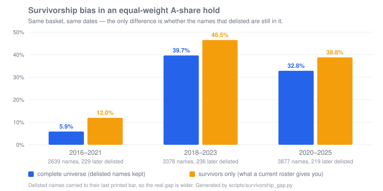

<div align="center">
  <h1>CNEquity · A local data foundation for China-market research</h1>
  <p><strong>Collect once, keep it current, and research from the same traceable data.</strong></p>

CNEquity turns market prices, financial statements, corporate events and capital-flow data into a local Parquet lake. It handles incremental ingestion, resumable batches, quality checks and consistent queries for individual researchers and small teams.

[](https://github.com/rootSunc/CNEquity/actions/workflows/ci.yml)
[](https://pypi.org/project/cnequity/)
[](docs/getting-started/installation.md)
[](LICENSE)

[中文](README.md) · [Documentation](https://rootsunc.github.io/CNEquity/) · [Dataset catalog](docs/datasets/catalog.md) · [Changelog](CHANGELOG.md)
</div>

## Data coverage

The current development tree registers **52 datasets: 47 curated + 5 derived**, organized into L0–L9. See the [catalog](docs/datasets/catalog.md) and [source limitations](docs/datasets/sources.md).

| Tier | Research use | Representative datasets |
|---|---|---|
| L0 | Reference | Instruments, trading calendar, trading status |
| L1 | Market data | Daily and index bars, adjustment factors, optional minutes and trade snapshots, delisting events |
| L2 | Corporate events | Actions, announcement index, disclosure schedule |
| L3 | Fundamentals | Financials, valuations, share structure, holders, consensus |
| L4 | Capital and flows | Northbound, margin trading, dragon-tiger lists, block trades, fund flows |
| L5 | Industry structure | Index constituents, industry and sector membership, industry index |
| L6 | Macro | Indicators and market breadth |
| L7 | News and rotation | News, wires, sentiment, rankings, sector prices and flows |
| L8 | Risk and regulation | Share unlocks and regulatory events |
| L9 | Derivatives | Futures and options contracts, contract bars, continuous futures, Greeks and minutes |

Minutes, trade snapshots and futures/options are disabled by default. Check each source's historical horizon and actual coverage after opting in.

## Quick start

Requires Python 3.10+ on macOS, Linux or Windows. No account or token needed.

```bash
pip install cnequity
cne init     # download the last 3 years for every Shanghai, Shenzhen and Beijing A-share; the first run can take hours
cne check    # confirm the data is complete and usable
```

If it stops halfway, run `cne init` again; nothing already downloaded is fetched twice.

Read the data:

```python
from cnequity.query import load

bars = load("daily_bars", symbols=["600519.SH"])
print(bars.tail())
```

Then run `cne run daily` once a day to stay current. For longer history, or what `init` does step by step, see the [initialization guide](docs/getting-started/initialization.md).

## Why keep a lake?

- **Spend less time rebuilding ingestion.** Normalize symbols and columns once, track incremental windows, and resume failed work without discarding successful batches. There are 22 source-probe routes; costly endpoints require explicit selection.
- **Make research assumptions explicit.** Store raw prices separately from adjustment factors; preserve delisted identities; distinguish strict point-in-time evidence from reconstructed history.
- **Keep provenance and versions.** Rows carry `source`, `data_version` and `fetched_at`; immutable generations and research snapshots support later inspection.
- **Own the storage.** Query open Parquet files through Python, DuckDB, Polars, the dashboard and a read-only MCP server.

### Survivorship bias: today's roster is not a historical universe

The same equal-weight buy-and-hold strategy over the same dates produces a different result when stocks that later delisted are omitted. This historical sample compares the two universe definitions:



*This historical sample illustrates universe selection. Its returns and stock counts do not describe current lake coverage or future investment performance. Delisted names are valued at their last available bar; see the [universe profiles](docs/reference/universe-profiles.md) for evidence limits.*

CNEquity retains delisted identities and makes adjustment, historical membership and PIT semantics part of the query contract.


*Illustrative dashboard screenshot, labelled ILLUSTRATIVE DEMO. Its 42/42 count, row total and size are fictional display values, not the current registry or your lake's coverage.*

If this is infrastructure you keep rebuilding, [give CNEquity a ⭐ Star](https://github.com/rootSunc/CNEquity) to find it again and help other researchers discover it.

## What can you research?

| Question | Data and example | Check first |
|---|---|---|
| Returns across dividends and splits | `daily_bars` + `adj_factors` · [adjustment recipe](docs/recipes/research-baseline.md) | Use `adjust="hfq"` and `strict_adj=True` |
| Financial facts visible on a rebalance date | `financial_statement_items` · [PIT recipe](docs/recipes/pit-rebalance.md) | Explicit `as_of` and `pit_mode="strict"`; backfilled history is not historical observation |
| Historical universes and pre-delisting prices | `instruments`, `trading_status`, `delisting_events` · [profiles](docs/reference/universe-profiles.md) | Validate ST, delisting and price coverage |
| Valuation, flows and sector rotation | Valuation, capital and structure datasets · [query guide](docs/datasets/query-guide.md) | Distinguish backfillable history from snapshots collected over time |
| Futures curves, option chains and Greeks | Contract-level prices and derived datasets · [derivatives](docs/recipes/derivatives.md) | Opt in; verify exchange coverage and lifecycle evidence |

## Architecture


Adapters and batch orchestration collect data into staging; validated batches become curated or derived data. Quality checks, Python and SQL queries, the dashboard and MCP consume published data. The diagram explains responsibilities; see the [data flow](docs/architecture/data-flow.md) and [catalog](docs/datasets/catalog.md) for current source protocols and enabled datasets.

## After init: daily updates

```bash
cne run daily
```

Schedule this one command every day, weekends included: on trading days it runs every enabled daily group, then updates announcements, regulatory events and news; on other days it runs only the event stream. The operations page in `cne serve` can install that daily run and the catch-up pass for the current user, without copying the repository scripts. Accept the lake with `cne check`, which exits non-zero on gaps or quality errors.

When you upgrade:

```bash
pip install -U cnequity
cne config upgrade
```

`cne config upgrade` adds the schedule steps a new release introduced to your config and keeps a backup of the original.

Continue with [initialization and recovery](docs/getting-started/initialization.md), then the [runbook](docs/operations/runbook.md). Detailed documentation is primarily in Chinese.

## One lake for Python, SQL and AI agents

Once your production lake contains prices and adjustment factors:

```python
from cnequity.query import load

bars = load(
    "daily_bars",
    symbols=["600519.SH"],
    start="2024-01-01",
    end="2024-12-31",
    adjust="hfq",
    strict_adj=True,
)
print(bars.select("trade_date", "close", "adj_close", "adj_is_exact"))
```

```bash
cne query --sql "SELECT symbol, max(trade_date) AS last_date FROM daily_bars GROUP BY symbol LIMIT 10"
cne mcp --config /abs/path/to/cnequity.toml
```

`load()` applies adjustment, PIT and universe semantics; `scan()` returns a raw LazyFrame. MCP defaults to reading the local lake through six tools for discovery, symbol resolution, prices, fundamentals, datasets and SQL. See [MCP setup](docs/reference/mcp.md) and the [Python API](docs/reference/python-api.md).

## Fit and limits

CNEquity fits repeated historical research, ongoing collection and self-hosted data operations. A direct source call is lighter for an occasional quote. Existing research and trading platforms can consume the lake; see [choosing a data workflow](docs/architecture/overview.md).

- The project is in **0.x development**. Repository documentation describes the current tree; the stable PyPI release may lag. Check `cne --version` and the [changelog](CHANGELOG.md).
- Public-source connectivity, retention and publication schedules vary. Basic collection needs no token; some supplemental sources require your own credentials and permissions.
- Fresh data does not establish complete historical coverage. Strict PIT may return no rows; strict universe queries may reject insufficient evidence.
- CNEquity supplies data infrastructure, not a backtesting engine, trading signals or order execution. Code is [Apache-2.0](LICENSE); upstream data has [separate terms](docs/legal-and-data-sources.md). No data lake is distributed with the repository.

## Documentation and contributions

| Task | Read |
|---|---|
| Install and get a result | [Installation](docs/getting-started/installation.md) · [Quickstart](docs/getting-started/quickstart.md) |
| Understand the data | [Catalog](docs/datasets/catalog.md) · [Schemas](docs/datasets/schema.md) · [Recipes](docs/recipes/README.md) |
| Find a command | [CLI](docs/reference/cli.md) · [Options](docs/reference/cli-options.md) · [Network/write effects](docs/reference/cli-surface.md) |
| Operate the lake | [Runbook](docs/operations/runbook.md) · [Fetch policy](docs/operations/fetch-policy.md) · [Troubleshooting](docs/operations/troubleshooting.md) |
| Product direction and feedback | [Product overview](docs/architecture/overview.md) · [Upgrades and feedback](docs/getting-started/installation.md#升级与兼容性) |

[Issues](https://github.com/rootSunc/CNEquity/issues) with minimal reproductions, documentation fixes and adapter PRs are welcome. Cite [CITATION.cff](CITATION.cff) for research; report vulnerabilities privately using the [security policy](SECURITY.md).

**Useful to you? [Star CNEquity](https://github.com/rootSunc/CNEquity), or share it with someone maintaining China-market data.**
