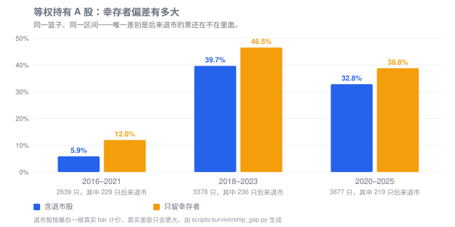
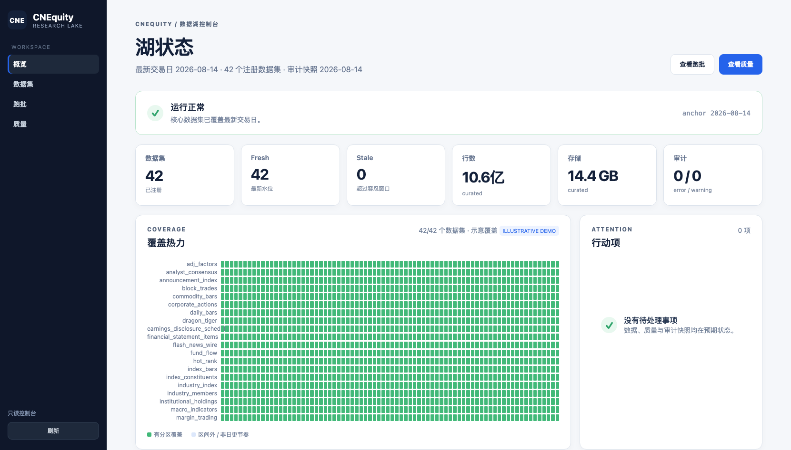
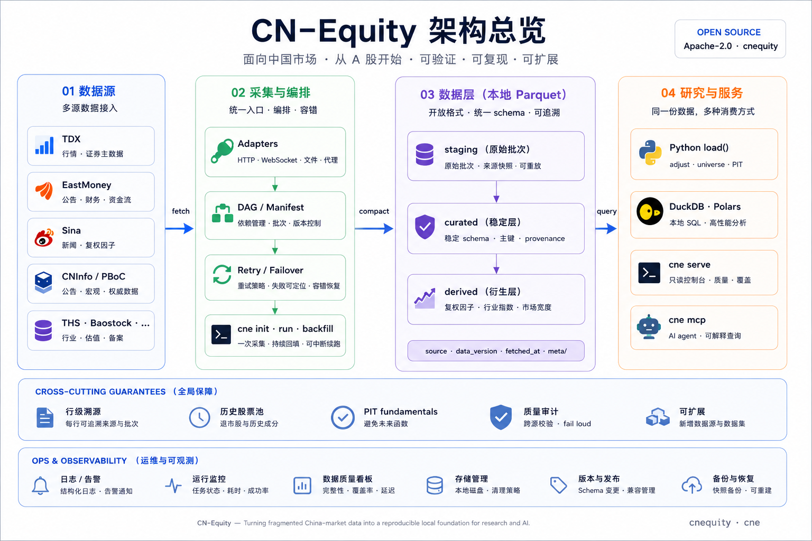

<div align="center">
  
  <h1>CNEquity · 中国市场金融数据湖</h1>
  <p><strong>打破数据垄断，构建属于每个人的本地金融数据集</strong></p>

CNEquity 将股票行情、期货合约、财报、公司事件和资金面等多源数据整理为本地 Parquet 数据湖，提供增量采集、失败续跑、质量审计与统一查询。适合反复回测、积累历史数据。提供个人研究者和AI Agent一套完整的金融数据解决方案。

[](https://github.com/rootSunc/CNEquity/actions/workflows/ci.yml)
[](https://pypi.org/project/cnequity/)
[](docs/getting-started/installation.md)
[](LICENSE)

[English](README.en.md) · [完整文档](https://rootsunc.github.io/CNEquity/) · [数据集目录](docs/datasets/catalog.md) · [更新日志](CHANGELOG.md)
</div>

## 数据范围

当前开发树注册 **52 个数据集：47 个 curated + 5 个 derived**，按用途分为 L0–L9。完整字段、主键、历史起点和来源集中在[数据集目录](docs/datasets/catalog.md)与[数据源说明](docs/datasets/sources.md)。

| 层次 | 研究用途 | 代表数据集 |
|---|---|---|
| L0 | 基础参考 | 证券主数据、交易日历、交易状态 |
| L1 | 行情 | 日线、指数、复权因子、可选分钟线与分笔、退市事件 |
| L2 | 公司事件 | 公司行为、公告索引、业绩披露预约 |
| L3 | 基本面 | 财报、估值、股本、股东、一致预期 |
| L4 | 资金面 | 北向、融资融券、龙虎榜、大宗交易、资金流 |
| L5 | 结构行业 | 指数成分、行业与板块成分、行业指数 |
| L6 | 宏观 | 宏观指标、市场宽度 |
| L7 | 舆情与轮动 | 新闻、快讯、情绪、人气、板块行情与资金流 |
| L8 | 风险合规 | 解禁日程、监管事件 |
| L9 | 衍生品 | 期货与期权合约、逐合约行情、连续合约、Greeks、分钟线 |

分钟线、分笔和期货/期权默认关闭；按需启用后仍须检查来源的历史视野与实际覆盖。

<details>
<summary>展开注册表的主备来源速查（实际路由与历史限制见数据集目录）</summary>

| 数据集 | 层次 | 登记主源 | 登记备源 |
|---|---|---|---|
| `instruments` | L0 | tdx_protocol | baostock |
| `etf_profiles` | L0 | exchange | — |
| `trading_calendar` | L0 | tdx_protocol | exchange |
| `trading_status` | L0 | eastmoney | exchange |
| `adj_factors` | L1 | sina | baostock |
| `daily_bars` | L1 | tdx_protocol | eastmoney |
| `delisting_events` | L1 | derived | — |
| `index_bars` | L1 | tdx_protocol | eastmoney |
| `minute_bars` | L1 | tdx_protocol | — |
| `minute_bars_5m` | L1 | tdx_protocol | — |
| `trade_ticks` | L1 | tdx_protocol | — |
| `announcement_index` | L2 | cninfo | — |
| `corporate_actions` | L2 | eastmoney | tdx_protocol |
| `earnings_disclosure_schedule` | L2 | eastmoney | — |
| `analyst_consensus` | L3 | eastmoney | — |
| `financial_statement_items` | L3 | eastmoney | — |
| `share_structure` | L3 | eastmoney | — |
| `shareholder_counts` | L3 | eastmoney | — |
| `top_holders` | L3 | eastmoney | — |
| `valuation_metrics` | L3 | eastmoney | — |
| `block_trades` | L4 | eastmoney | exchange |
| `dragon_tiger` | L4 | eastmoney | exchange |
| `fund_flow` | L4 | eastmoney | — |
| `fund_flow_ths` | L4 | ths | — |
| `institutional_holdings` | L4 | eastmoney | — |
| `margin_trading` | L4 | exchange | — |
| `northbound_flows` | L4 | eastmoney | — |
| `northbound_holdings` | L4 | eastmoney | — |
| `index_constituents` | L5 | eastmoney | — |
| `industry_index` | L5 | derived | — |
| `industry_members` | L5 | eastmoney | — |
| `sector_members` | L5 | eastmoney | — |
| `macro_indicators` | L6 | eastmoney | pboc |
| `market_breadth` | L6 | derived | — |
| `economic_calendar` | L7 | eastmoney | — |
| `flash_news_wire` | L7 | eastmoney | — |
| `hot_rank` | L7 | eastmoney | — |
| `news_headlines` | L7 | eastmoney | — |
| `sector_bars` | L7 | ths | — |
| `sector_fund_flow` | L7 | eastmoney | — |
| `sector_fund_flow_ths` | L7 | ths | — |
| `sentiment_scores` | L7 | derived | eastmoney |
| `regulatory_events` | L8 | cninfo | — |
| `share_unlock_schedule` | L8 | eastmoney | — |
| `commodity_bars` | L9 | sina | eastmoney |
| `futures_bars` | L9 | futures_exchange | — |
| `futures_continuous` | L9 | derived | — |
| `futures_contracts` | L9 | futures_exchange | — |
| `futures_minute_bars` | L9 | sina | — |
| `option_bars` | L9 | futures_exchange | — |
| `option_contracts` | L9 | futures_exchange | — |
| `option_greeks` | L9 | derived | — |

登记主备源是数据集元数据；日更 tip、历史回填和显式修复可能走不同路径。请结合[来源说明](docs/datasets/sources.md)使用。

</details>


## 快速开始

需要 Python 3.10+（macOS / Linux / Windows），不需要账号或 token。

```bash
pip install cnequity
cne init     # 下载沪深京全市场最近 3 年的数据，第一次可能需要几个小时
cne check    # 检查数据是否完整、可用
```

中途断了，再运行一次 `cne init`，已经下载的部分不会重来。

读取数据：

```python
from cnequity.query import load

bars = load("daily_bars", symbols=["600519.SH"])
print(bars.tail())
```

之后每天运行一次 `cne run daily` 保持更新。想要更长的历史，或了解 `init` 具体做了什么，见[初始化指南](docs/getting-started/initialization.md)。

## 为什么值得把数据管起来

- **少写重复的数据工程。** 代码、字段、分区和增量窗口由数据层管理；中断后保留成功批次，按失败范围续跑。22 条源探针路由帮助诊断可达性（高成本端点需显式选择）。
- **把研究口径说清楚。** 原始价与复权因子分开存；历史股票池保留退市身份；财报查询区分严格 PIT 与事后重建。
- **结果有来源，也有版本。** 行级 `source`、`data_version`、`fetched_at` 配合不可变数据版本与研究快照，支持复查和重现。
- **数据留在自己手里。** 开放的 Parquet 文件，通过 Python、DuckDB、Polars、只读 MCP 和控制台消费。

### 幸存者偏差：今天的名单不能代替历史股票池

同一等权买入持有策略、同一时间窗口，仅按今天仍在交易的股票回看过去，会漏掉后来退市的标的。下图用历史样本展示两种股票池得到的结果差异：



*历史样本仅用于说明股票池口径；图中收益和标的数量不代表当前湖覆盖或未来投资表现。退市股按最后一根可用行情计价，因子及退市覆盖限制见[股票池画像](docs/reference/universe-profiles.md)。*

CNEquity 在数据层保留退市身份，并让复权、历史成分和 PIT 口径进入查询契约，避免下游研究在无意中丢掉这些标的。



*控制台示意截图（标有 ILLUSTRATIVE DEMO）；图中的 42/42、行数和容量均为虚构展示值，不是当前注册数量或实际覆盖。*

如果这正是你一直在重复搭建的数据底座，欢迎给 [CNEquity 一个 ⭐ Star](https://github.com/rootSunc/CNEquity)，方便找回，也帮助更多研究者发现它。

## 能用它研究什么

| 你的问题 | 数据与入口 | 需要确认的口径 |
|---|---|---|
| 跨分红、送转后的历史收益 | `daily_bars` + `adj_factors` · [复权示例](docs/recipes/research-baseline.md) | `adjust="hfq"`，研究时开启 `strict_adj=True` |
| 某个调仓日已经知道哪些财报信息 | `financial_statement_items` · [PIT 示例](docs/recipes/pit-rebalance.md) | 显式 `as_of` + `pit_mode="strict"`；新回填不等于当时可见 |
| 历史股票池、退市前行情 | `instruments`、`trading_status`、`delisting_events` · [股票池画像](docs/reference/universe-profiles.md) | 历史 ST、退市和行情覆盖需另行核验 |
| 估值、资金流、行业轮动 | `valuation_metrics`、资金面与结构数据 · [查询指南](docs/datasets/query-guide.md) | 分清可回补历史与启用后积累的快照 |
| 期货期限结构、期权链与 Greeks | 逐合约行情和派生数据 · [衍生品指南](docs/recipes/derivatives.md) | 默认关闭，按交易所、合约生命周期与覆盖证据验收 |


## 架构



数据经适配器与批次编排进入 staging，校验后发布为 curated 或 derived 数据；质量审计、Python/SQL 查询、控制台和 MCP 围绕已发布数据工作。图示用于说明职责边界，具体来源协议与启用状态以[数据流说明](docs/architecture/data-flow.md)和[数据集目录](docs/datasets/catalog.md)为准。

## 初始化之后：每日更新

```bash
cne run daily
```

每天（含周末）用系统调度器运行这一条：交易日跑行情及其他已启用的日更组，然后更新公告、监管事件和资讯；非交易日只更新事件流。验收用 `cne check`，有缺口或质量 error 时返回非零。

升级版本时：

```bash
pip install -U cnequity
cne config upgrade
```

`cne config upgrade` 把新版本加入的调度 step 补进你的配置，原文件自动备份。

继续阅读：[初始化、范围与续跑](docs/getting-started/initialization.md) → [日常运维](docs/operations/runbook.md)。

## Python、SQL 和 AI agent 共用一份数据

已建立含复权因子的正式湖后：

```python
from cnequity.query import load

bars = load(
    "daily_bars",
    symbols=["600519.SH"],
    start="2024-01-01",
    end="2024-12-31",
    adjust="hfq",
    strict_adj=True,
)
print(bars.select("trade_date", "close", "adj_close", "adj_is_exact"))
```

```bash
cne query --sql "SELECT symbol, max(trade_date) AS last_date FROM daily_bars GROUP BY symbol LIMIT 10"
cne mcp --config /abs/path/to/cnequity.toml
```

`load()` 提供复权、PIT 和股票池语义；`scan()` 提供原始 LazyFrame。MCP 默认只读本地湖，提供描述、代码解析、行情、财报、通用数据集和 SQL 六类工具。客户端配置见 [MCP 指南](docs/reference/mcp.md)，查询边界见 [Python API](docs/reference/python-api.md)。

## 适合与边界

**适合**持续积累历史、反复查询、检查研究口径和自托管数据的工作。若只需偶尔取一个最新报价，直接调用取数接口通常更轻；已有研究或交易平台也可以把 CNEquity 放在数据层，见[选型说明](docs/comparison.md)。

- 当前处于 **0.x 迭代阶段**。本仓库文档对应当前实现，PyPI 稳定版可能落后；升级前核对 `cne --version` 和[更新日志](CHANGELOG.md)。
- 公共来源的网络可达性、历史深度和发布节奏会变化。基础采集无需 token，部分补充来源需要自备凭证；安装不代表获得所有上游权限。
- `fresh` 表示新鲜度，不能单独证明历史完整或研究有效。严格 PIT 可能返回空结果，历史股票池可能因证据不足拒绝读取。
- 项目提供数据基础设施，不含回测引擎、交易信号或下单功能。代码采用 [Apache-2.0](LICENSE)，数据另受[上游许可](docs/legal-and-data-sources.md)约束，仓库不附带数据湖。

## 文档与参与

| 想做什么 | 从这里开始 |
|---|---|
| 安装、跑通首个查询 | [安装](docs/getting-started/installation.md) · [快速开始](docs/getting-started/quickstart.md) |
| 找数据、确认口径 | [目录](docs/datasets/catalog.md) · [字段](docs/datasets/schema.md) · [研究示例](docs/recipes/README.md) |
| 查命令、参数和副作用 | [CLI](docs/reference/cli.md) · [参数默认值](docs/reference/cli-options.md) · [联网与写入清单](docs/reference/cli-surface.md) |
| 配调度、处理失败 | [运行手册](docs/operations/runbook.md) · [取数与源保护](docs/operations/fetch-policy.md) · [排障](docs/operations/troubleshooting.md) |
| 理解产品方向与反馈问题 | [产品设计](docs/architecture/overview.md) · [升级与反馈](docs/getting-started/upgrading.md) |

欢迎提交带最小复现的 [Issue](https://github.com/rootSunc/CNEquity/issues)、文档修正或数据适配 PR。研究引用见 [CITATION.cff](CITATION.cff)；安全问题请按[安全策略](SECURITY.md)私下报告。

**觉得有用？[点一个 Star](https://github.com/rootSunc/CNEquity)，或把项目分享给同样在维护 A 股数据的人。**
